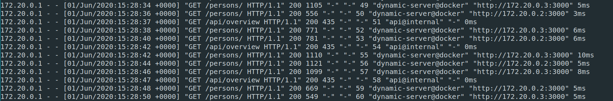

# HTTP Infrastructure

```
Author : Sacha Perdrizat, Pablo Mercado
```

## Step 6 Extra: LoadBalancing

Dans cette étape bonus nous allons configurer un Loadbalancer pour permettre la répartition des requêtes à travers plusieurs noeud applicatif.

### Traefik
Nous allons pour ce faire changer notre infrastructure dès maintenant pour découvrir un nouveau reverse proxy ``Traefik``. Traefik possède beaucoup de fonctionnalités très pertinentes pour la gestion des noeud, la principal étant qu'il est conçu pour s'intégrer très simplement avec docker (la configuration des noeud est automatique). Nous aurons besoin d'un autre outil docker-compose.

### docker-compose
Très brièvement, docker-compose nous permet de définir dans un fichier ``docker-compose.yml`` un équivalent des commande que nous écrirons au lancement d'un container, cela nous épargne la tâche d'avoir à stocker le lancement du container dans un script mais surtout il est possible de définir plusieurs lancement de container dans le même fichier.

## mise en place de l'environnement
Nous avons donc remplacé l'image apache par une image de Traefik et cela via le fichier ``docker-compose.yml``, nous en avons profiter pour y placer nos autre containers ainsi leurs lancement puisse s'effectuer simplement via la commande:

```bash
$ docker-compose up -d
```

Pour un exemple basique du LoadBalancing lançons notre environnement de la manière suivante afin d'avoir 2 instance de notre image dynamic lancé

```bash
$ docker-compose up -d --scale dynamic-server=2
```

Rappelons que notre application ``static`` effectue des requête AJAX en continue sur le container ``dynamic``

On peut observer les l'alternance entre les deux service que notre reverse proxy effectue.



## Annexe: la configuration de treafik

Traefik est configurable de plusieurs manières, on peut spécifier certaine propriété lié dans un fichier ``.toml`` ou ``.yml`` ou bien, ce que nous avons fait dans ce labo, spécifier les paramètre au lancement du container Treafik via le champ ``commande`` et les propriété lié au différent noeuds via le champ ``label`` (ce n'est évidemment pas recommandé si l'on a une configuration conséquente à appliquer).

Pour le LoadBalancing treafik nous mâche le travail car il est capable de reconnaître les containers issue d'une même image et nous les regroupera en un seul service. On peut même y accéder à une interface web pour visualiser la configuration (accessible via ``http://localhost:8080``).
