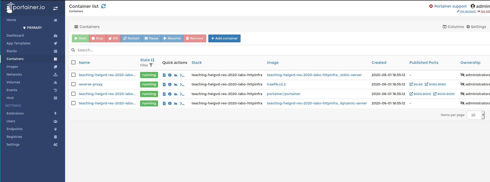

# HTTP Infrastructure

```
Author : Sacha Perdrizat, Pablo Mercado
```

## Step 6 Extra: Management UI

Dans cette petite étape nous allons ajouter une interface web pour permettre à nos container d'être manipulé autrement que depuis la ligne de commande.

### Portainer

Il s'avère que des interface web pour la gestion des container, il en existe déjà, pour cette étape nous utiliserons [Portainer](https://portainer.readthedocs.io/en/stable/) qui va grandement nous simplifier la tâche.

### déploiement

Selon la [documentation](https://portainer.readthedocs.io/en/latest/deployment.html#deploy-portainer-via-docker-compose) il est possible de déployer Portainer dans un container avec docker-compose (mis en place dans la partie sur le load balancing et treafik) directement, récupérons alors la configuration dans notre fichier ``docker-compose.yml`` et lançons tout simplement

```bash
$ docker-compose up -d
```

Et la magie opère, nous avons maintenant accès via l'URL ``http://localhost:9000`` à une interface (la création d'un compte est requise lors du premier démarrage) et nous pouvons naviguer sous notre *Stack* dans l'onglet ``container``.


